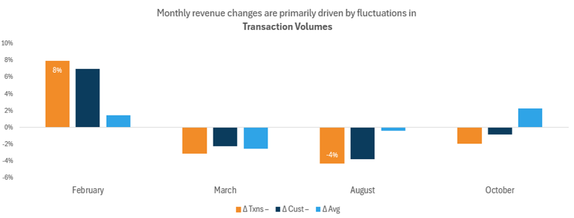
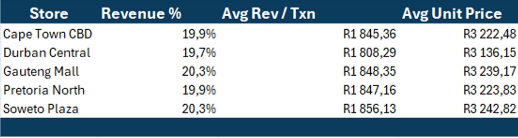

  
  <h2>Ecommerce Performance Report</h2>

---
### Client Background

BrightWave Retailers is a national retail chain specializing in consumer goods, ranging from electronics and home appliances to fashion and groceries.

With over **50 stores nationwide** and a rapidly expanding e-commerce presence, the company serves a diverse customer base across multiple regions.

As a trusted retail brand, BrightWave focuses on delivering high-quality products while maintaining excellent customer experiences across both physical and digital channels.

Management identified the need for deeper insight into revenue performance across stores and product categories to support strategic decision-making and long-term growth.

  ### Business Context

BrightWave’s leadership is particularly focused on understanding:

- Monthly revenue performance and overall trends  
- Key drivers behind revenue growth or decline  
- Customer purchasing behavior and transaction value patterns  
- Store-level and product-category contribution to total revenue  
- The balance between new customer acquisition and returning customer sales  
 
This report provides a structured analysis designed to support **data-driven operational and commercial decisions**.

 ### Business Questions

<ul style="font-size: 9px; font-weight: normal;">
  <li>How is revenue performing month-to-month across the retail chain?</li>
  <li>Are there identifiable seasonal spikes or revenue dips?</li>
  <li>What factors drive changes in revenue between specific months?</li>
  <li>Are revenue declines driven by fewer customers or smaller average transaction sizes?</li>
  <li>Which stores and product categories contribute most to total revenue?</li>
  <li>Is revenue primarily driven by returning customers or new customers?</li>
</ul>

### Primary KPI

#### Revenue

Revenue serves as the **central performance metric** for this analysis.  
All insights, trends, and recommendations presented in this report are directly linked back to revenue performance.

### Purpose of This Analysis

The objective of this report is to provide management with **clear, actionable insights** into BrightWave Retailers’ ecommerce and retail performance, enabling:

- Improved revenue forecasting  
- Deeper understanding of customer behavior  
- Identification of high-performing and underperforming stores  
- Data-backed commercial and marketing decisions  
---
  

     <h2>Executive Snapshot: Revenue Performance at a Glance</h2>
  
 

  
  
  ###### Figure: Monthly revenue performance and key fluctuations across the year

<table>
  <caption>Executive Snapshot: Revenue Performance at a Glance</caption>
  <tr>
    <th>Aspect</th>
    <th>Insight</th>
  </tr>
  <tr>
    <td>Overall Performance</td>
    <td>Revenue remained broadly stable throughout the year, fluctuating within a narrow range of approximately <strong>R7.4M – R8.1M per month</strong>, with no sustained month-on-month growth trend.</td>
  </tr>
  <tr>
    <td>Peak & Lowest Months</td>
    <td><strong>January</strong> recorded the highest revenue (<strong>R8.06M</strong>), while <strong>February</strong> marked the lowest point following the largest decline (<strong>-8%, -R619k</strong>).</td>
  </tr>
  <tr>
    <td>Recovery Pattern</td>
    <td>A partial recovery was observed in <strong>March (+5%, +R389k)</strong>, however gains were not consistently maintained in subsequent months.</td>
  </tr>
  <tr>
    <td>Mid-Year Volatility</td>
    <td>Performance from <strong>April to September</strong> showed repeated short-term declines and brief recoveries, indicating <strong>volatility rather than trend-driven growth</strong>.</td>
  </tr>
  <tr>
    <td>Late-Year Performance</td>
    <td><strong>August and October</strong> delivered moderate rebounds, but improvements were not sustained over consecutive months.</td>
  </tr>
  <tr>
    <td>Executive Interpretation</td>
    <td>The business remains <strong>financially stable</strong>, with revenue movements driven by short-term dynamics. Opportunity exists to focus on <strong>stabilising mid-year performance</strong>, strengthening customer retention, and converting short-term recoveries into <strong>sustained revenue growth</strong>.</td>
  </tr>
</table>
</body>
</html>

     <h2>Revenue Movement Analysis: Month-to-Month Drivers</h2>
  
 
    

    
  
 
     
  ### Key Findings

<table>
  <caption>Executive Snapshot: Revenue Performance & Key Drivers</caption>
  <tr>
    <th>Aspect</th>
    <th>Insight</th>
  </tr>

  <tr>
    <td>Overall Performance</td>
    <td>
     Revenue stayed stable mainly because customer activity stayed similar each month, not because of price changes or business expansion
    </td>
  </tr>

  <tr>
    <td>Primary Revenue Driver</td>
    <td>
      Month-to-month revenue movements were primarily driven by changes in <strong>transaction volumes</strong>
      rather than pricing or customer mix, indicating a volume-led revenue model.
    </td>
  </tr>

  <tr>
    <td>Material Revenue Movements</td>
    <td>
      Only a limited number of months experienced material revenue changes.
      <strong>February (-8%)</strong>, <strong>March (+5%)</strong>, <strong>August (+4%)</strong>, and
      <strong>October (+4%)</strong> exceeded the ±4% materiality threshold and were therefore analysed in detail.
    </td>
  </tr>

  <tr>
    <td>Revenue Declines</td>
    <td>
      Revenue declines were largely <strong>volume-driven</strong>, reflecting reduced transaction and customer
      activity rather than pricing pressure. <strong>February</strong> and <strong>June</strong> declines coincided
      with decreases in both transactions and customers, while average revenue per transaction remained stable.
    </td>
  </tr>

  <tr>
    <td>Revenue Increases</td>
    <td>
      Revenue recoveries were driven by improvements in <strong>transaction and customer volumes</strong>.
      <strong>March</strong>, <strong>August</strong>, and <strong>October</strong> show transaction-led growth
      supported by stable or marginal changes in average revenue per transaction.
    </td>
  </tr>

  <tr>
    <td>Pricing & Basket Size</td>
    <td>
      Pricing effects and average basket size played a <strong>secondary role</strong> in revenue performance.
      Average revenue per transaction fluctuated within a narrow range, indicating limited pricing impact on
      overall revenue movement.
    </td>
  </tr>

  <tr>
    <td>Customer Trends</td>
    <td>
      Customer volumes closely mirrored transaction trends, reinforcing a <strong>demand-driven revenue structure</strong>.
      Periods of customer decline aligned with revenue softening, while recovery months showed increased customer participation.
    </td>
  </tr>

  <tr>
    <td>Operational Interpretation</td>
    <td>
      Most month-to-month revenue fluctuations represent <strong>normal operational variability</strong> rather
      than structural change. Sub-4% revenue movements were treated as normal noise and excluded from primary
      driver analysis.
    </td>
  </tr>

  <tr>
    <td>Strategic Implication</td>
    <td>
      Sustainable revenue growth will depend more on <strong>increasing transaction activity</strong> than on
      adjusting prices. Strengthening demand, customer engagement, and conversion will be key to translating
      short-term recoveries into sustained growth.
    </td>
  </tr>
</table>

  

     <h2>Revenue Composition Analysis: Store & Product Drivers</h2>  
      <h3>Store-Level Revenue Drivers</h3> 
  
 

    
  

  
   
 
  
 ### Key Findings
<table>
  <caption>Executive Snapshot: Store-Level Revenue Performance</caption>
  <tr>
    <th>Aspect</th>
    <th>Insight</th>
  </tr>

  <tr>
    <td>Overall Store Contribution</td>
    <td>
      No single store stands out as a main revenue driver. All stores perform at similar levels, so growth needs to come from the full store network rather than one location
    </td>
  </tr>

  <tr>
    <td>Top Contributing Stores</td>
    <td>
      <strong>Gauteng Mall</strong> and <strong>Soweto Plaza</strong> were the highest contributors, each accounting
      for approximately <strong>20.3%</strong> of total revenue, closely followed by the remaining locations.
    </td>
  </tr>

  <tr>
    <td>Revenue Balance Across Locations</td>
    <td>
      Revenue performance across stores is highly balanced, with total annual revenue per store ranging narrowly
      between approximately <strong>R18.1M and R18.7M</strong>.
    </td>
  </tr>

  <tr>
    <td>Transaction Volumes</td>
    <td>
      Transaction volumes are broadly similar across all locations, reinforcing the evenly distributed revenue pattern
      and indicating consistent customer demand across regions.
    </td>
  </tr>

  <tr>
    <td>Average Revenue per Transaction</td>
    <td>
      Average revenue per transaction is consistent across stores, ranging between approximately
      <strong>R1,808 and R1,856</strong>, suggesting limited variation in pricing or basket composition by location.
    </td>
  </tr>

  <tr>
    <td>Average Unit Price</td>
    <td>
      Average unit prices are tightly clustered across stores, indicating standardized pricing and a uniform product mix
      across locations.
    </td>
  </tr>

  <tr>
    <td>Monthly Store Performance</td>
    <td>
      Monthly revenue trends show similar movement patterns across all locations, with stores experiencing
      synchronized increases and declines rather than location-specific volatility.
    </td>
  </tr>

  <tr>
    <td>Customer Behaviour</td>
    <td>
      Distinct customer counts at the total level are lower than the sum across individual stores, indicating that
      customers frequently shop at multiple locations and demonstrating strong cross-store engagement.
    </td>
  </tr>

  <tr>
    <td>Operational Interpretation</td>
    <td>
      The absence of significant revenue concentration or divergence suggests that store performance differences are
      driven by normal operational variability rather than structural or geographic advantages.
    </td>
  </tr>

  <tr>
    <td>Strategic Implication</td>
    <td>
      Future revenue growth is more likely to be achieved through network-wide demand stimulation and customer
      engagement initiatives rather than focusing on individual store expansion or pricing changes.
    </td>
  </tr>
</table>
      

      <h3>Product Category Revenue Drivers</h3> 
  
 
    

     

  
   

      
 ### Key Findings
  <table>
  <caption>Executive Snapshot: Product Category Revenue Performance</caption>
  <tr>
    <th>Aspect</th>
    <th>Insight</th>
  </tr>

  <tr>
    <td>Overall Category Contribution</td>
    <td>
      Revenue does not depend on one product category. All categories contribute similar amounts, which lowers business risk.
    </td>
  </tr>

  <tr>
    <td>Top Revenue Categories</td>
    <td>
      <strong>Clothing</strong> (25.2%) and <strong>Accessories</strong> (25.1%) were the highest contributors,
      though differences between categories are minimal and not strategically significant.
    </td>
  </tr>

  <tr>
    <td>Revenue Balance Across Categories</td>
    <td>
      Annual revenue per category falls within a narrow range of approximately
      <strong>R22.9M – R23.2M</strong>, highlighting strong balance and limited concentration risk.
    </td>
  </tr>

  <tr>
    <td>Transaction Volumes</td>
    <td>
      Transaction volumes are highly comparable across categories, with each recording approximately
      <strong>12,400 – 12,600 transactions</strong>, reinforcing the evenly distributed revenue outcome.
    </td>
  </tr>

  <tr>
    <td>Units Sold</td>
    <td>
      Units sold are evenly spread across categories, indicating consistent customer demand and similar purchasing
      behaviour across product types.
    </td>
  </tr>

  <tr>
    <td>Average Revenue per Transaction</td>
    <td>
      Average revenue per transaction is consistent across all categories, ranging between approximately
      <strong>R1,836 and R1,845</strong>, suggesting limited variation in basket value by category.
    </td>
  </tr>

  <tr>
    <td>Average Unit Price</td>
    <td>
      Average unit prices are tightly clustered across categories, indicating standardized pricing and a balanced
      mix of product price points.
    </td>
  </tr>

  <tr>
    <td>Product Mix Interpretation</td>
    <td>
      Comparable performance across categories suggests a diversified and resilient product mix, reducing
      dependency on any single category for revenue generation.
    </td>
  </tr>

  <tr>
    <td>Strategic Implication</td>
    <td>
      Future revenue growth can be driven through broad-based category initiatives rather than prioritising a
      single product category, supporting a stable and scalable revenue strategy.
    </td>
  </tr>

  <tr>
    <td>Overall Insight</td>
    <td>
      The business’s revenue is driven by consistent performance across both store locations and product
      categories, indicating a <strong>stable, diversified, and low-risk revenue structure</strong>.
    </td>
  </tr>
</table>

  <h3>Customer Retention & Acquisition Revenue Analysis</h3>

  

### Key Findings

<table>
  <caption>Executive Snapshot: New vs Returning Customer Performance</caption>

  <tr>
    <th>Aspect</th>
    <th>Insight</th>
  </tr>

  <tr>
    <td>Overall Revenue Composition</td>
    <td>
      Most revenue comes from returning customers rather than new customers, showing strong loyalty but weak new customer growth.
    </td>
  </tr>

  <tr>
    <td>Customer Retention Impact</td>
    <td>
      The strong dominance of returning-customer revenue highlights a
      <strong>highly loyal customer base</strong>, indicating successful retention and
      repeat-purchase behaviour throughout the year.
    </td>
  </tr>

  <tr>
    <td>New Customer Revenue Trend</td>
    <td>
      New customer revenue is heavily front-loaded, peaking in
      <strong>January (R6.27M)</strong> before declining sharply and steadily across the year,
      suggesting limited sustained acquisition momentum.
    </td>
  </tr>

  <tr>
    <td>Returning Customer Revenue Trend</td>
    <td>
      Revenue from returning customers increases consistently from February onward,
      stabilising at approximately <strong>R7.4M – R7.7M per month</strong> in the second half
      of the year.
    </td>
  </tr>

  <tr>
    <td>Customer Volume Dynamics</td>
    <td>
      New customer counts decline significantly from
      <strong>3,356 in January</strong> to fewer than <strong>100 per month</strong> by
      August–December, while returning customer counts remain stable at approximately
      <strong>3,200–3,300 customers per month</strong>.
    </td>
  </tr>

  <tr>
    <td>Revenue per Customer Insight</td>
    <td>
      Despite declining new customer volumes, overall revenue stability is maintained,
      indicating that <strong>returning customers generate higher and more consistent
      revenue per customer</strong>.
    </td>
  </tr>

  <tr>
    <td>Sales Driver Assessment</td>
    <td>
      Monthly sales performance is primarily driven by
      <strong>repeat purchases rather than customer acquisition</strong>, making retention
      the key engine of revenue stability.
    </td>
  </tr>

  <tr>
    <td>Risk Consideration</td>
    <td>
      Heavy reliance on returning customers presents a potential long-term risk if
      acquisition channels are not revitalised to replenish the customer base.
    </td>
  </tr>

  <tr>
    <td>Strategic Implication</td>
    <td>
      While retention strategies are clearly effective, future growth will require
      <strong>strengthening new customer acquisition</strong> to complement an already
      strong loyalty-driven revenue model.
    </td>
  </tr>

  <tr>
    <td>Overall Insight</td>
    <td>
      The business demonstrates a <strong>mature and stable revenue model</strong> anchored
      by loyal customers; however, sustainable long-term growth will depend on balancing
      retention strength with renewed customer acquisition efforts.
    </td>
  </tr>

</table>

<!-- ===================== CONCLUSION ===================== -->

  <h2>Conclusion: Executive Summary</h2>

BrightWave Retailers demonstrates a <strong>stable and resilient revenue model</strong>,
supported by balanced store and product performance and a highly loyal customer base.

Revenue fluctuations are primarily volume-driven, confirming that customer engagement
and demand generation are more critical than pricing strategies.

<h3>Key Strategic Takeaways</h3>
<ul>
  <li>Revenue stability is underpinned by diversification</li>
  <li>Transaction volume is the primary growth lever</li>
  <li>Returning customers ensure consistency</li>
  <li>New customer acquisition requires renewed focus</li>
</ul>

<h3>High-Level Recommendations</h3>
<ul>
  <li>Strengthen acquisition initiatives</li>
  <li>Leverage loyal customers through referrals</li>
  <li>Stabilise mid-year demand fluctuations</li>
</ul>

  <strong>Portfolio Project | Data Analytics & Business Intelligence</strong> 
  BrightWave Retailers – Ecommerce Performance Analysis

</body>
</html>
