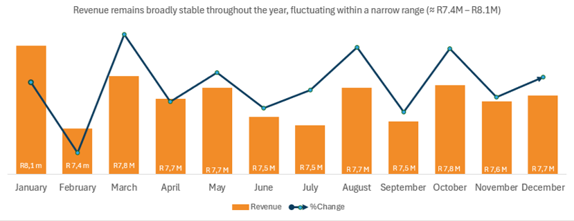
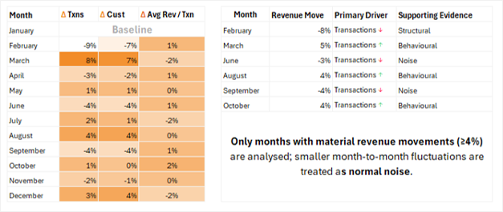
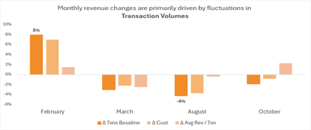
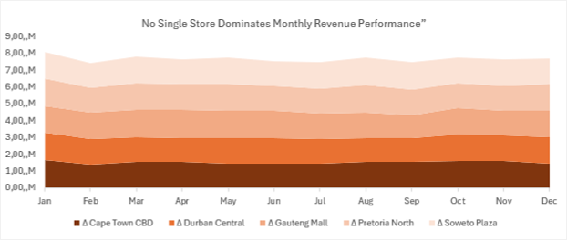
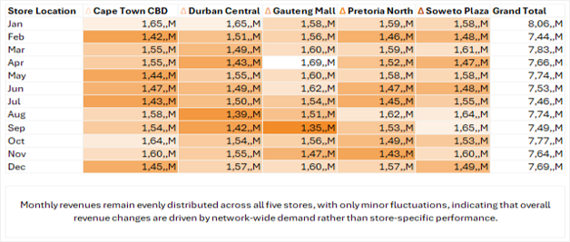
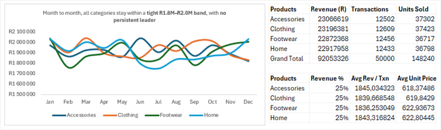
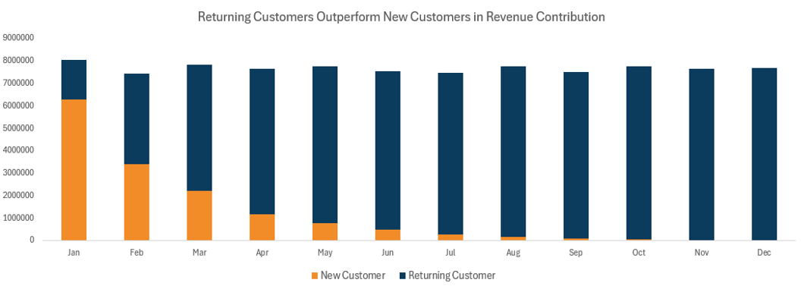

---

  
  <h2>Ecommerce Performance Report</h2>

---
### Client Background

BrightWave Retailers is a national retail chain selling consumer goods, including electronics, home appliances, fashion, and groceries.

With over **50 stores nationwide** and a growing e-commerce presence, the company serves a wide range of customers across multiple regions.

As a trusted brand, BrightWave focuses on high-quality products and excellent customer experiences, both in-store and online.

Management wanted a deeper understanding of revenue performance across stores and product categories to support better decision-making and long-term growth.

### Business Context

BrightWave’s leadership wants to understand:

- Monthly revenue performance and overall trends  
- Main factors behind revenue increases or decreases  
- Customer buying patterns and transaction values  
- Contribution of each store and product category to total revenue  
- Balance between new and returning customer sales  

This report provides a clear analysis to support **data-driven business decisions**.

### Business Questions

<ul style="font-size: 9px; font-weight: normal;">
  <li>How does revenue change month-to-month across the chain?</li>
  <li>Are there seasonal peaks or drops?</li>
  <li>What causes revenue changes between months?</li>
  <li>Are revenue drops due to fewer customers or smaller transactions?</li>
  <li>Which stores and product categories generate most revenue?</li>
  <li>Is revenue mainly from new or returning customers?</li>
</ul>

### Primary KPI

#### Revenue

Revenue is the **main performance metric** for this analysis.  
All insights and recommendations link directly to revenue performance.

### Purpose of This Analysis

This report provides management with **clear, actionable insights** into BrightWave Retailers’ ecommerce and store performance to help with:

- Better revenue forecasting  
- Understanding customer behavior  
- Identifying high and low performing stores  
- Making data-backed commercial and marketing decisions  

---

  <h2>Executive Snapshot: Revenue Performance Overview</h2>

 

  
  
  ###### Figure 1: Monthly revenue performance and fluctuations throughout the year

<table>
  <tr>
    <th>Aspect</th>
    <th>Insight</th>
  </tr>
  <tr>
    <td>Overall Performance</td>
    <td>Revenue stayed mostly stable, ranging from <strong>R7.4M – R8.1M per month</strong>, with no steady growth trend.</td>
  </tr>
  <tr>
    <td>Peak & Lowest Months</td>
    <td><strong>January</strong> had the highest revenue (<strong>R8.06M</strong>), while <strong>February</strong> had the lowest following the largest drop (<strong>-8%, -R619k</strong>).</td>
  </tr>
  <tr>
    <td>Recovery Pattern</td>
    <td><strong>March (+5%, +R389k)</strong> saw some recovery, but gains weren’t maintained consistently in later months.</td>
  </tr>
  <tr>
    <td>Mid-Year Volatility</td>
    <td>From <strong>April to September</strong>, revenue showed short-term declines and rebounds, indicating <strong>volatility rather than steady growth</strong>.</td>
  </tr>
  <tr>
    <td>Late-Year Performance</td>
    <td><strong>August and October</strong> had moderate rebounds, but these were not sustained over consecutive months.</td>
  </tr>
  <tr>
    <td>Executive Interpretation</td>
    <td>The business is <strong>financially stable</strong>, with revenue changes driven by short-term factors. Opportunity exists to <strong>stabilize mid-year performance</strong> and convert temporary gains into <strong>long-term growth</strong>.</td>
  </tr>
</table>

  <h2>Revenue Movement Analysis: Monthly Drivers</h2>

 

  

 

  

  
### Key Findings

<table>
  <tr>
    <th>Aspect</th>
    <th>Insight</th>
  </tr>
  <tr>
    <td>Overall Performance</td>
    <td>Revenue stayed stable because customer activity remained similar each month, not due to price changes or business growth.</td>
  </tr>
  <tr>
    <td>Primary Revenue Driver</td>
    <td>Monthly revenue changes were mainly due to <strong>transaction volumes</strong>, showing a volume-driven revenue model.</td>
  </tr>
  <tr>
    <td>Material Revenue Movements</td>
    <td>Only a few months saw significant revenue changes: <strong>February (-8%)</strong>, <strong>March (+5%)</strong>, <strong>August (+4%)</strong>, and <strong>October (+4%)</strong>.</td>
  </tr>
  <tr>
    <td>Revenue Declines</td>
    <td>Drops were mainly <strong>volume-driven</strong>, due to fewer transactions and customers, while average revenue per transaction stayed stable.</td>
  </tr>
  <tr>
    <td>Revenue Increases</td>
    <td>Revenue growth was due to higher <strong>transaction and customer volumes</strong>, with stable average revenue per transaction.</td>
  </tr>
  <tr>
    <td>Pricing & Basket Size</td>
    <td>Pricing and average basket size had a <strong>minor effect</strong> on revenue. Average revenue per transaction varied little.</td>
  </tr>
  <tr>
    <td>Customer Trends</td>
    <td>Customer numbers closely followed transaction trends, confirming a <strong>demand-driven revenue model</strong>.</td>
  </tr>
  <tr>
    <td>Operational Interpretation</td>
    <td>Most monthly revenue changes are <strong>normal operational fluctuations</strong>. Movements below 4% were treated as normal noise.</td>
  </tr>
  <tr>
    <td>Strategic Implication</td>
    <td>Future revenue growth should focus on <strong>increasing transactions and customer engagement</strong> rather than changing prices.</td>
  </tr>
</table>

  <h2>Revenue Composition Analysis: Store & Product Drivers</h2>  
  <h3>Store-Level Revenue Drivers</h3> 

 

  

  

 

### Key Findings

<table>
  <tr>
    <th>Aspect</th>
    <th>Insight</th>
  </tr>
  <tr>
    <td>Overall Store Contribution</td>
    <td>No single store dominates revenue. All stores perform similarly, so growth relies on the full network.</td>
  </tr>
  <tr>
    <td>Top Contributing Stores</td>
    <td><strong>Gauteng Mall</strong> and <strong>Soweto Plaza</strong> contributed the most, each about <strong>20.3%</strong> of total revenue.</td>
  </tr>
  <tr>
    <td>Revenue Balance Across Locations</td>
    <td>Annual revenue per store ranges from <strong>R18.1M to R18.7M</strong>, showing balance.</td>
  </tr>
  <tr>
    <td>Transaction Volumes</td>
    <td>Transaction volumes are similar across stores, showing consistent customer demand.</td>
  </tr>
  <tr>
    <td>Average Revenue per Transaction</td>
    <td>Average revenue per transaction is consistent across stores, ranging from <strong>R1,808 – R1,856</strong>.</td>
  </tr>
  <tr>
    <td>Average Unit Price</td>
    <td>Unit prices are similar, showing standardized pricing and product mix.</td>
  </tr>
  <tr>
    <td>Monthly Store Performance</td>
    <td>Stores show similar monthly trends, with increases and decreases happening together.</td>
  </tr>
  <tr>
    <td>Customer Behaviour</td>
    <td>Some customers shop at multiple stores, showing strong cross-store engagement.</td>
  </tr>
  <tr>
    <td>Operational Interpretation</td>
    <td>Revenue differences are mostly normal fluctuations, not structural advantages.</td>
  </tr>
  <tr>
    <td>Strategic Implication</td>
    <td>Future growth should focus on network-wide demand and engagement, not just one store.</td>
  </tr>
</table>

  <h3>Product Category Revenue Drivers</h3> 

 

  

### Key Findings

<table>
  <tr>
    <th>Aspect</th>
    <th>Insight</th>
  </tr>
  <tr>
    <td>Overall Category Contribution</td>
    <td>Revenue is spread across categories, reducing risk from relying on a single category.</td>
  </tr>
  <tr>
    <td>Top Revenue Categories</td>
    <td><strong>Clothing</strong> (25.2%) and <strong>Accessories</strong> (25.1%) are the top contributors, but differences are small.</td>
  </tr>
  <tr>
    <td>Revenue Balance Across Categories</td>
    <td>Annual revenue per category ranges from <strong>R22.9M – R23.2M</strong>, showing balance.</td>
  </tr>
  <tr>
    <td>Transaction Volumes</td>
    <td>Transactions per category are similar, around <strong>12,400 – 12,600</strong>.</td>
  </tr>
  <tr>
    <td>Units Sold</td>
    <td>Units sold are evenly spread, showing consistent demand across categories.</td>
  </tr>
  <tr>
    <td>Average Revenue per Transaction</td>
    <td>Average revenue per transaction is consistent, ranging from <strong>R1,836 – R1,845</strong>.</td>
  </tr>
  <tr>
    <td>Average Unit Price</td>
    <td>Unit prices are similar, showing standardized pricing and balanced product mix.</td>
  </tr>
  <tr>
    <td>Product Mix Interpretation</td>
    <td>Balanced performance reduces reliance on any single category.</td>
  </tr>
  <tr>
    <td>Strategic Implication</td>
    <td>Growth should come from all categories, supporting a stable revenue strategy.</td>
  </tr>
  <tr>
    <td>Overall Insight</td>
    <td>Revenue is consistent across stores and categories, showing a <strong>stable, low-risk revenue structure</strong>.</td>
  </tr>
</table>

  <h3>Customer Retention & Acquisition Analysis</h3>

  

### Key Findings

<table>
  <tr>
    <th>Aspect</th>
    <th>Insight</th>
  </tr>
  <tr>
    <td>Overall Revenue Composition</td>
    <td>Most revenue comes from returning customers, showing strong loyalty but weak growth from new customers.</td>
  </tr>
  <tr>
    <td>Customer Retention Impact</td>
    <td>Returning customers dominate revenue, showing successful retention and repeat purchases.</td>
  </tr>
  <tr>
    <td>New Customer Revenue Trend</td>
    <td>New customer revenue peaks in <strong>January (R6.27M)</strong> but drops sharply after, showing weak sustained acquisition.</td>
  </tr>
  <tr>
    <td>Returning Customer Revenue Trend</td>
    <td>Revenue from returning customers grows steadily from February, stabilising at <strong>R7.4M – R7.7M per month</strong> later in the year.</td>
  </tr>
  <tr>
    <td>Customer Volume Dynamics</td>
    <td>New customer counts fall from <strong>3,356 in January</strong> to under 100 per month by August–December. Returning customers stay around <strong>3,200–3,300</strong>.</td>
  </tr>
  <tr>
    <td>Revenue per Customer Insight</td>
    <td>Stable revenue despite fewer new customers shows that returning customers generate higher, steadier revenue.</td>
  </tr>
  <tr>
    <td>Sales Driver Assessment</td>
    <td>Revenue is mainly driven by repeat purchases, making retention key.</td>
  </tr>
  <tr>
    <td>Risk Consideration</td>
    <td>Relying too much on returning customers is risky if new customer acquisition is not strengthened.</td>
  </tr>
  <tr>
    <td>Strategic Implication</td>
    <td>Retention is strong, but future growth needs <strong>more focus on acquiring new customers</strong>.</td>
  </tr>
  <tr>
    <td>Overall Insight</td>
    <td>The business has a <strong>stable, loyalty-driven revenue model</strong>, but long-term growth depends on balancing retention with new customer acquisition.</td>
  </tr>
</table>

 

  <h2>Conclusion: Executive Summary</h2>

BrightWave Retailers has stable revenue, but future growth depends on attracting new customers, not just relying on existing ones.

Revenue changes are mainly volume-driven, showing that customer engagement matters more than pricing.

<h3>Key Strategic Takeaways</h3>
<ul>
  <li>Revenue stability comes from diversification</li>
  <li>Transaction volume is the main growth driver</li>
  <li>Returning customers ensure consistency</li>
  <li>New customer acquisition needs renewed focus</li>
</ul>

<h3>High-Level Recommendations</h3>
<ul>
  <li>Boost new customer acquisition</li>
  <li>Leverage loyal customers for referrals</li>
  <li>Stabilize mid-year demand fluctuations</li>
</ul>

  <strong>Portfolio Project | Data Analytics & Business Intelligence</strong> 
  BrightWave Retailers – Ecommerce Performance Analysis

