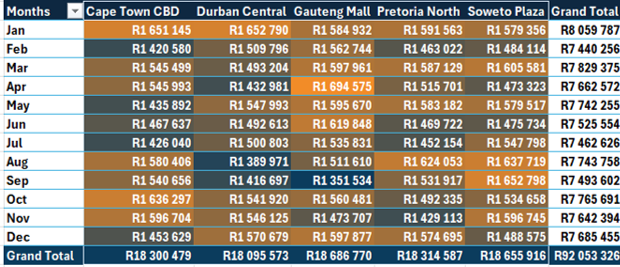
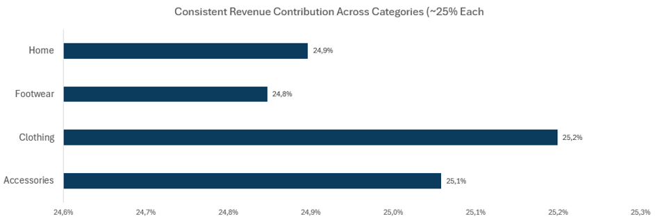
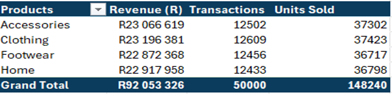
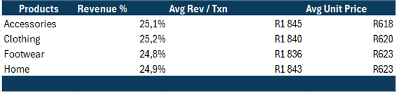

  
  <h2>Ecommerce Performance Report</h2>

---
### Client Background

BrightWave Retailers is a national retail chain specializing in consumer goods, ranging from electronics and home appliances to fashion and groceries.

With over **50 stores nationwide** and a rapidly expanding e-commerce presence, the company serves a diverse customer base across multiple regions.

As a trusted retail brand, BrightWave focuses on delivering high-quality products while maintaining excellent customer experiences across both physical and digital channels.

Management identified the need for deeper insight into revenue performance across stores and product categories to support strategic decision-making and long-term growth.

  ### Business Context

BrightWave’s leadership is particularly focused on understanding:

- Monthly revenue performance and overall trends  
- Key drivers behind revenue growth or decline  
- Customer purchasing behavior and transaction value patterns  
- Store-level and product-category contribution to total revenue  
- The balance between new customer acquisition and returning customer sales  
 
This report provides a structured analysis designed to support **data-driven operational and commercial decisions**.

 ### Business Questions

<ul style="font-size: 9px; font-weight: normal;">
  <li>How is revenue performing month-to-month across the retail chain?</li>
  <li>Are there identifiable seasonal spikes or revenue dips?</li>
  <li>What factors drive changes in revenue between specific months?</li>
  <li>Are revenue declines driven by fewer customers or smaller average transaction sizes?</li>
  <li>Which stores and product categories contribute most to total revenue?</li>
  <li>Is revenue primarily driven by returning customers or new customers?</li>
</ul>

### Primary KPI

#### Revenue

Revenue serves as the **central performance metric** for this analysis.  
All insights, trends, and recommendations presented in this report are directly linked back to revenue performance.

### Purpose of This Analysis

The objective of this report is to provide management with **clear, actionable insights** into BrightWave Retailers’ ecommerce and retail performance, enabling:

- Improved revenue forecasting  
- Deeper understanding of customer behavior  
- Identification of high-performing and underperforming stores  
- Data-backed commercial and marketing decisions  
---
  

     <h2>Executive Snapshot: Revenue Performance at a Glance</h2>
  
 

  
  
  ###### Figure: Monthly revenue performance and key fluctuations across the year

<table>
  <caption>Executive Snapshot: Revenue Performance at a Glance</caption>
  <tr>
    <th>Aspect</th>
    <th>Insight</th>
  </tr>
  <tr>
    <td>Overall Performance</td>
    <td>Revenue remained broadly stable throughout the year, fluctuating within a narrow range of approximately <strong>R7.4M – R8.1M per month</strong>, with no sustained month-on-month growth trend.</td>
  </tr>
  <tr>
    <td>Peak & Lowest Months</td>
    <td><strong>January</strong> recorded the highest revenue (<strong>R8.06M</strong>), while <strong>February</strong> marked the lowest point following the largest decline (<strong>-8%, -R619k</strong>).</td>
  </tr>
  <tr>
    <td>Recovery Pattern</td>
    <td>A partial recovery was observed in <strong>March (+5%, +R389k)</strong>, however gains were not consistently maintained in subsequent months.</td>
  </tr>
  <tr>
    <td>Mid-Year Volatility</td>
    <td>Performance from <strong>April to September</strong> showed repeated short-term declines and brief recoveries, indicating <strong>volatility rather than trend-driven growth</strong>.</td>
  </tr>
  <tr>
    <td>Late-Year Performance</td>
    <td><strong>August and October</strong> delivered moderate rebounds, but improvements were not sustained over consecutive months.</td>
  </tr>
  <tr>
    <td>Executive Interpretation</td>
    <td>The business remains <strong>financially stable</strong>, with revenue movements driven by short-term dynamics. Opportunity exists to focus on <strong>stabilising mid-year performance</strong>, strengthening customer retention, and converting short-term recoveries into <strong>sustained revenue growth</strong>.</td>
  </tr>
</table>
</body>
</html>

     <h2>Revenue Movement Analysis: Month-to-Month Drivers</h2>
  
 
    

    
  
 
     
  ### Key Findings
<tr>
  <td><strong>Key Revenue Driver</strong></td>
  <td>
    Month-to-month revenue changes were primarily driven by changes in transaction volumes rather than pricing or customer mix.
  </td>
  <td>
    Months with revenue growth or decline show strong alignment with transaction movements (e.g., February −9% Txns, March +8% Txns).
  </td>
</tr>

<tr>
  <td><strong>Material Revenue Movements</strong></td>
  <td>
    Meaningful revenue changes occurred only in a limited number of months.
  </td>
  <td>
    Only February (−8%), March (+5%), August (+4%), and October (+4%) exceeded the ±4% materiality threshold.
  </td>
</tr>

<tr>
  <td><strong>Revenue Declines</strong></td>
  <td>
    Revenue declines were largely volume-driven and not structural pricing issues.
  </td>
  <td>
    February (−8%) and June (−3%) declines coincided with decreases in transactions and customers, while average revenue per transaction remained stable or improved.
  </td>
</tr>

<tr>
  <td><strong>Revenue Increases</strong></td>
  <td>
    Revenue recoveries were driven by higher customer engagement and transaction activity.
  </td>
  <td>
    March, August, and October show simultaneous increases in transactions and customers, with minimal contribution from price changes.
  </td>
</tr>

<tr>
  <td><strong>Pricing & Basket Size</strong></td>
  <td>
    Pricing and average basket size played a secondary role in revenue movement.
  </td>
  <td>
    Average revenue per transaction remained relatively stable across the year, with marginal month-to-month variation (±2%).
  </td>
</tr>

<tr>
  <td><strong>Customer Trends</strong></td>
  <td>
    Customer volumes closely tracked transaction trends, reinforcing volume-led performance dynamics.
  </td>
  <td>
    Months with declining customers (February, June, September) align with revenue softening, while recovery months show customer growth.
  </td>
</tr>

<tr>
  <td><strong>Operational Interpretation</strong></td>
  <td>
    Most monthly revenue movements reflect normal operational variability rather than structural shifts.
  </td>
  <td>
    Sub-4% revenue changes were classified as noise and excluded from driver analysis.
  </td>
</tr>

<tr>
  <td><strong>Strategic Implication</strong></td>
  <td>
    Sustainable revenue growth will depend on increasing transaction activity rather than adjusting prices.
  </td>
  <td>
    No evidence of sustained pricing uplift; transaction growth consistently explains revenue improvements.
  </td>
</tr>

  

     <h2>Revenue Composition Analysis: Store & Product Drivers</h2>  
      <h3>Store-Level Revenue Drivers</h3> 
  
 

    
  

  
   
 
     

  
   

     

  
   

     ### Key Findings

   - Revenue is evenly distributed across all store locations, with each contributing approximately 19–20% of total revenue, driven by similar transaction volumes.
      

      <h3>Product Category Revenue Drivers</h3> 
  
 
    

     

  
   

      

  
   

      

  
   

  j

 

